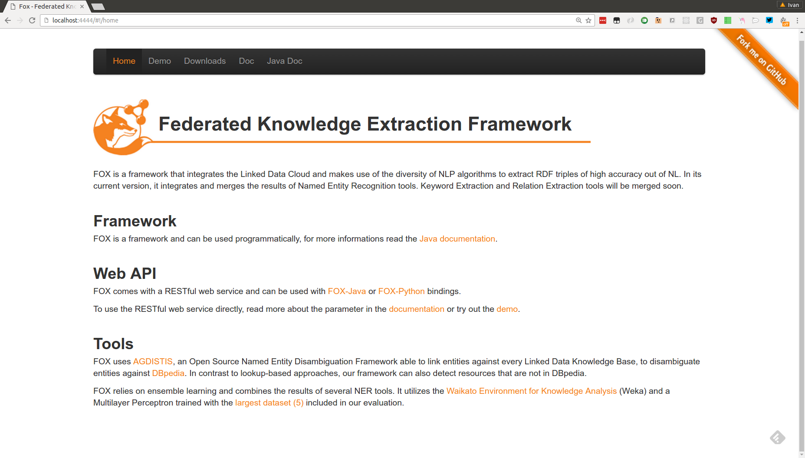

# Federated knOwledge eXtraction Framework (FOX)

**Academic use only! See LICENSE section below.**

- [FOX homepage](http://aksw.org/Projects/FOX.html)
- [FOX on the Github](https://github.com/AKSW/fox)

## Run standalone FOX container

    docker run -d -e XMX=8G -e LNG=en --name fox -p 4444:4444 bde2020/fox

To configure fox at runtime use the following environment variables, set them `-e <Variable>=<Value>[-e ...[]]

- `XMX`: configures the jvm memory settings, default `8G`
- `LNG`: sets the language to be trained, currently `en` `de` are supported, default `de`

## Run as a service in docker-compose definition
```
version: '2'

services:
  fox:
    image: bde2020/fox:latest
    environment:
      - XMX=8G
      - LNG=en
    ports:
      - "4444:4444"
```

We include example docker-compose.yml definition in this repository. You can run it as:
```
docker-compose up -d
```
## Accessing FOX interface
After exposing port 4444, the FOX application should be accessible through the browser following the http://docker-host:4444 URI. You will see an interface as follows:


## LICENSE

FOX is licensed under the GNU GPL Version 2, June 1991. 
As FOX uses external libraries, by using FOX you also agree to their license agreements. 
An incomplete list of libraries is as follows:
* Illinois NLP Pipeline (University of Illinois Research and Academic Use License)
* Stanford CoreNLP (GNU GPL Version 2)
* Apache OpenNLP (Apache License, Version 2)
* Balie (GNU GPL Version 2)

